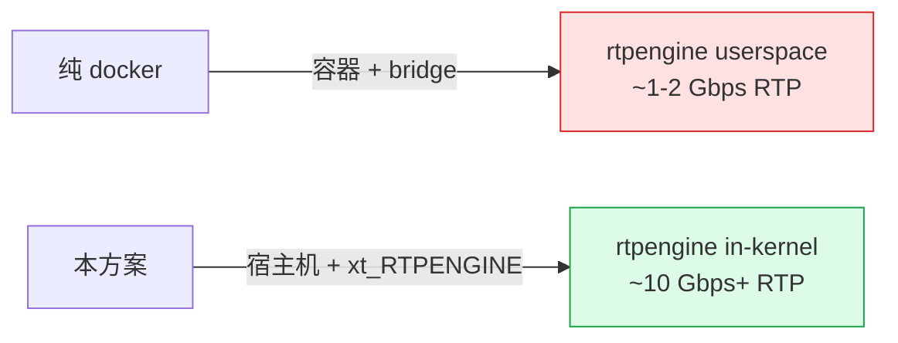
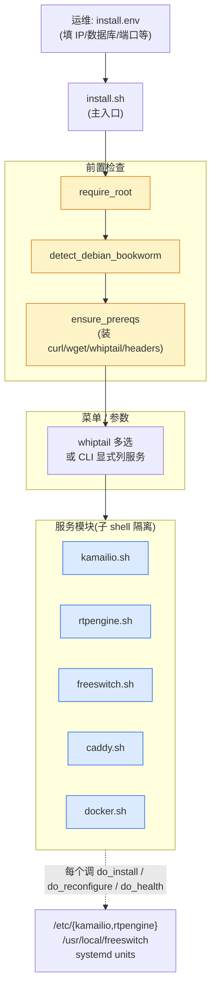
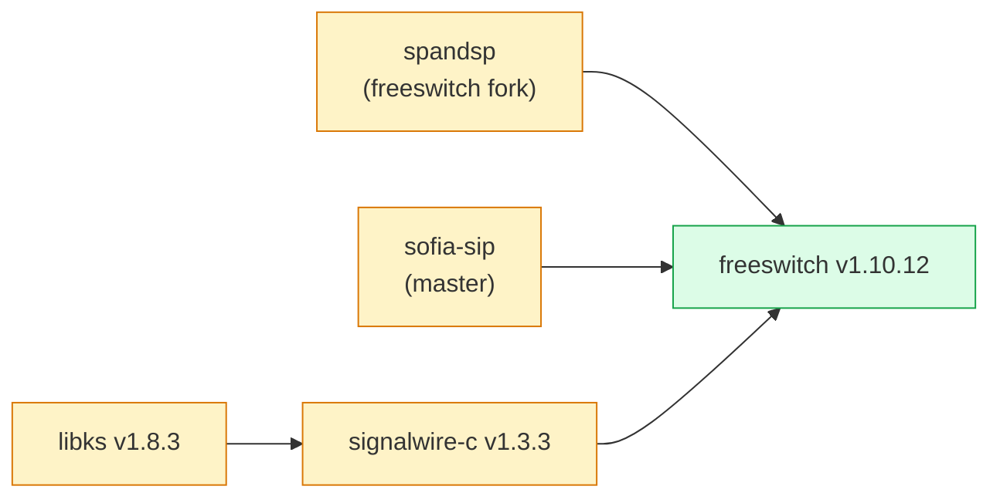

# 从零搭一台 SBC:我的 Debian 12 自动化部署方案

> **TL;DR**
> SBC(Session Border Controller)= **SIP 代理 + 媒体代理 + 媒体服务器** 三件套。本文给出一个**完全自动化**的部署方案:300 行 bash 把 kamailio 5.8、rtpengine 12.5.1(in-kernel)、FreeSWITCH 1.10.12 在一台 Debian 12 上装好、跑起来、能通过 `systemctl restart` 重渲配置。
>
> 不是 docker-compose,是**宿主机原生部署** + **systemd 托管** + **apt 官方仓库** + **FreeSWITCH 源码编译**。所有踩坑点都列在文里。
>
> **适合谁读**:正在搭呼叫中心 / 云通信平台、对"装一台 SBC 要点几次回车"心存怀疑的后端 / DevOps。读完你应该能 `git clone && ./install.sh` 跑出来一台能打电话的机器。

<!-- 封面图建议:用本仓库的 cover.html 渲染 -->

---

## 0. 为什么不用 Docker

参考实现(`aicallcenter-deploy/`)是 docker-compose 跑的,本仓库是宿主机版。差异源于两个硬约束:

1. **rtpengine in-kernel 模式**:`table = 0` 要求加载 `xt_RTPENGINE` 内核模块,容器里只能跑 `table = -1`(userspace 转发),性能差一个数量级
2. **FreeSWITCH 体量**:freeswitch + sounds + 编译依赖打成镜像 ~3GB,本身就违背 docker 的"轻量"哲学

加一条软约束:**SIP 信令对网络延迟极敏感**,中间多一层 docker bridge 容易引入抖动。生产场景如果不是追求"一台机器跑几十种业务",直接装在 host 上更省心。



---

## 1. 整体架构:install.sh 在做什么



每个服务一个 `.sh` 文件,**约定三个函数**:`do_install`、`do_reconfigure`、`do_health`。`install.sh` 用子 shell `source` 后调用对应函数,**子 shell 隔离**保证服务模块之间不会变量串台。

```bash
# install.sh 核心调度逻辑
for s in "${services[@]}"; do
  echo ">>> ${action}: $s"
  ( # 子 shell 隔离
    source "$SERVICES_DIR/$s.sh"
    "do_${action}"
  )
done
```

`install.env` 和 `install.env.example` 分离 —— 真实凭据走 `install.env`,被 `.gitignore` 屏蔽。**永远不要**把数据库密码 commit 进仓库。

---

## 2. 用户视角:从 0 到能打电话

```bash
# 1. 拷一份配置模板
cp install/install.env.example install/install.env
vim install/install.env  # 填 IP / 数据库 / 网关地址

# 2. 加载环境变量
set -a
source install/install.env
set +a

# 3. 一键装
sudo -E ./install/install.sh install
```

`sudo -E` 的 `-E` **关键**。普通 `sudo` 会清空大部分环境变量(留下 PATH/HOME 等少数),`install.env` 里那些 `PUBLIC_IP`、`DB_PASS` 全没了。`-E` 保留环境,变量才能传到子进程的 install.sh。

弹出 whiptail 多选菜单:

```
┌───────────── 选择服务 ─────────────┐
│  [*] kamailio                       │
│  [*] rtpengine                      │
│  [ ] caddy                          │
│  [*] freeswitch                     │
│  [ ] docker                         │
│                                     │
│        <  OK  >    <Cancel>         │
└─────────────────────────────────────┘
```

空格勾选,Tab 切到 OK,回车。或者跳过菜单直接传参:

```bash
sudo -E ./install/install.sh install kamailio rtpengine
```

非交互场景(CI、远程脚本)**必须显式传服务名** —— 没有 tty 时 whiptail 起不来,会直接报错退出。

---

## 3. 关键设计 1:模板渲染 render_tpl

每个服务的配置文件都是模板(`*.tpl`),占位符形如 `__PUBLIC_IP__`、`__DB_PASS__`。`common.sh` 里的 `render_tpl` 负责替换:

```bash
render_tpl "$src" "$dst" KEY1=val1 KEY2=val2 ...
```

看似简单,实际有三个坑:

### 坑 1:awk -v 的 C 风格转义

最直觉的写法:

```bash
awk -v val="$val" '{ gsub("__KEY__", val) }'   # ❌ 错
```

`awk -v` 把传入值当 **C 字符串字面量**处理,`\n` 变换行、`\t` 变制表符。**密码里有 `\` 就完蛋**。本仓库的解法:用 `export` + `ENVIRON[]` 让 awk 从环境变量取值,绕过 `-v` 的转义:

```bash
# render_tpl 核心
export "v${i}=$val"
awk 'BEGIN{ v0=ENVIRON["v0"]; ... }
     { ... }'
```

### 坑 2:gsub 的 & 元字符

```awk
gsub("__KEY__", val)   # ❌ val 里如果有 &,会被当反向引用
```

`&` 在 `gsub` 的替换串里代表"匹配到的整段"。SDP 里有 `c=IN IP4 1.2.3.4` 这种行,值里出现 `&` 不算罕见。换成 `index() + substr()` 循环手工替换:

```awk
{ r=""; t=line;
  while((p=index(t,k0))>0){
    r = r substr(t,1,p-1) v0;
    t = substr(t,p+kl0)
  };
  line = r t
}
```

### 坑 3:渲染完不检查残留就出门

```bash
leftover="$(grep -oE '__[A-Z][A-Z0-9_]*__' "$dst" | sort -u || true)"
if [ -n "$leftover" ]; then
  echo "ERROR: 渲染后残留占位符:" >&2
  echo "$leftover" >&2
  return 1
fi
```

**忘了某个 KEY 没传**是最常见的失误。grep 一遍 `__XXX__` 形式的字符串,有残留立刻报错,**不让残破的配置文件落到生产**。

---

## 4. 关键设计 2:apt 源密钥统一走 keyrings

`apt-key` 在 Debian 11 之后已废弃。本仓库三个 apt 源(kamailio / sipwise / docker)统一用 `signed-by` 模式:

```bash
install -d -m 0755 /etc/apt/keyrings
wget -qO- "http://deb.kamailio.org/kamailiodebkey.gpg" \
  | gpg --batch --no-tty --yes --dearmor -o /etc/apt/keyrings/kamailio.gpg
chmod 0644 /etc/apt/keyrings/kamailio.gpg

cat > /etc/apt/sources.list.d/kamailio.list <<EOF
deb [signed-by=/etc/apt/keyrings/kamailio.gpg] http://deb.kamailio.org/kamailio58 bookworm main
EOF

apt-get update \
  -o Dir::Etc::sourcelist="sources.list.d/kamailio.list" \
  -o Dir::Etc::sourceparts="-" \
  -o APT::Get::List-Cleanup="0"
```

最后那个 `apt-get update` **只刷新自己加的源**,不重跑全部源。三个服务全装时这一步省下大约 30 秒(尤其网络慢的时候)。

**bookworm 硬编码**:三个源全部固定 `bookworm`。原因在 `CLAUDE.md` 里写得很清楚:

- kamailio:`deb.kamailio.org/kamailio58 bookworm main`
- sipwise:**只发布 bookworm**(`spce/${RELEASE}/ bookworm main`)
- docker:`download.docker.com/linux/debian bookworm stable`

**Ubuntu 不行**。Ubuntu 22.04 的 `libavcodec58` 和 Debian 12 的 `libavcodec59` ABI 不兼容,sipwise 的 rtpengine deb 包依赖会死锁。**目标 OS 锁死 Debian 12**,不接受其他发行版。

---

## 5. kamailio:Debian 包陷阱 `/etc/default/kamailio`

这是本仓库踩过最深的坑。先看 Debian 包自带的 systemd unit:

```ini
[Service]
EnvironmentFile=-/etc/default/kamailio
ExecStart=/usr/sbin/kamailio -DD -P $PIDFILE -f $CFGFILE -m $SHM_MEMORY -M $PKG_MEMORY ...
```

注意 `EnvironmentFile=-/etc/default/kamailio` 前面那个 **`-` 号** —— "文件不存在或变量缺失,**静默继续**"。

再看包默认安装的 `/etc/default/kamailio`:

```bash
# 包自带的默认内容
RUN_KAMAILIO=yes
```

**只有一个变量**。`$CFGFILE`、`$SHM_MEMORY`、`$PKG_MEMORY` 全是空。`-f ""` 在 kamailio 里等价于 `-f /etc/kamailio/kamailio.cfg` 吗?**不,等价于不传 -f**,kamailio 退化跑**内置默认 cfg**,listen 5060,绑所有网卡,**你写在 `/etc/kamailio/kamailio.cfg` 里的配置完全没生效**。

故障表现:服务正常 active,端口监听对了一半,但路由逻辑全错,你 grep 自己的 lua 脚本看日志一个 hit 都没有。

修法:**整体重写** `/etc/default/kamailio`。

```bash
# install/services/kamailio.sh::_kam_render_default_file
cat > /etc/default/kamailio <<EOF
# Managed by sbc install script. Do not edit; rerun reconfigure instead.
RUN_KAMAILIO=yes
CFGFILE=/etc/kamailio/kamailio.cfg
SHM_MEMORY=${SHM_MEMORY}
PKG_MEMORY=${PKG_MEMORY}
USER=kamailio
GROUP=kamailio
EOF
```

**不要用 sed 单行替换**。少一个变量就再走一遍静默退化。

`do_install` 的完整流程:

```bash
do_install() {
  _kam_check_vars        # require_vars,任一空字符串就报错列出
  _kam_check_iface       # ip 命令确认 LISTEN_IFACE 存在、PRIVATE_IP 绑在上面
  _kam_add_repo          # 加 apt 源
  _kam_install_pkgs      # apt install kamailio + 各种 modules
  _kam_render            # render_tpl 生成 kamailio.cfg / kamailio.lua
  _kam_install_dropin    # systemd drop-in:Restart=always + ulimits
  systemctl enable kamailio
  systemctl restart kamailio
  wait_for_active kamailio 30 || {
    journalctl -u kamailio -n 50 --no-pager >&2
    return 1
  }
  do_health
}
```

**注意 `restart` 而不是 `start`**:apt 安装 kamailio 时 postinst 已经 start 过一次,用的是包默认配置。我们写完新配置必须 restart 让新的生效。

---

## 6. rtpengine:DKMS 编译内核模块

```bash
do_install() {
  _rtpe_check_vars
  _rtpe_add_repo               # sipwise 源
  _rtpe_install_pkgs           # apt install ngcp-rtpengine + ngcp-rtpengine-kernel-dkms
  _rtpe_load_kernel_mod        # modprobe xt_RTPENGINE
  _rtpe_render                 # 渲染 rtpengine.conf
  _rtpe_install_dropin
  systemctl enable ngcp-rtpengine-daemon
  systemctl restart ngcp-rtpengine-daemon
  wait_for_active ngcp-rtpengine-daemon 15 || {
    lsmod | grep xt_RTPENGINE >&2 || echo "(hint: DKMS 编译失败?)" >&2
    journalctl -u ngcp-rtpengine-daemon -n 50 --no-pager >&2
    return 1
  }
  do_health
}
```

关键点 4 个:

### 6.1 dkms 需要 linux-headers

`ensure_prereqs` 在选了 rtpengine 时追加:

```bash
needed+=(dkms "linux-headers-$(uname -r)")
```

**用 `$(uname -r)` 不是 `linux-headers-amd64`**。云主机经常跑着各种自定义内核,装 metapackage 可能装不到匹配版本,DKMS 编译就挂。

### 6.2 modprobe 失败要给提示

```bash
if ! modprobe xt_RTPENGINE 2>&1; then
  echo "ERROR: 加载 xt_RTPENGINE 失败,检查 DKMS 状态:" >&2
  dkms status 2>/dev/null | grep -i rtpengine >&2 \
    || echo "(dkms 未显示 rtpengine 条目,headers 不匹配?)" >&2
  return 1
fi
```

DKMS 失败时 `dkms status` 一般会显示 `Module compilation failed`。直接抛给用户,不让他自己挖日志。

### 6.3 modules-load.d 让重启后自动加载

```bash
echo "xt_RTPENGINE" > /etc/modules-load.d/rtpengine.conf
```

重启宿主机后 `systemd-modules-load.service` 会自动 modprobe 这个模块。

### 6.4 drop-in 必须放对名字

```ini
# install/systemd/ngcp-rtpengine-daemon.service.d/override.conf
[Unit]
After=network-online.target systemd-modules-load.service
ConditionPathExists=/sys/module/xt_RTPENGINE
```

**坑**:Debian 12 包的真实 unit 名是 `ngcp-rtpengine-daemon.service`,而 `rtpengine-daemon.service` 只是 alias。drop-in 必须放在**真名目录**(`ngcp-rtpengine-daemon.service.d/`),否则 systemd **不为 alias 加载 drop-in**,你的 `Restart=always` 静默失效。

`ConditionPathExists=/sys/module/xt_RTPENGINE` 保证内核模块没加载时,systemd 直接跳过启动而不是反复重试。

---

## 7. FreeSWITCH:源码编译 + 国内加速

FreeSWITCH 没有官方 Debian 12 apt 仓库(老的 1.6 系列除外),只能源码编译。版本固定 **v1.10.12**,依赖链:



每个依赖项都从 GitHub 拉源码,编译,装到 `/usr/local`。整个过程在好网络下 ~15 分钟,差网络下能跑 1 小时+。

### 7.1 幂等保护

```bash
_fs_build_from_source() {
  if [ -x "$FS_PREFIX/bin/freeswitch" ]; then
    echo "[freeswitch] 已存在,跳过编译" >&2
    return 0
  fi
  ...
}
```

`/usr/local/freeswitch/bin/freeswitch` 存在就跳过整个编译。要重编先 `rm` 这个文件。

### 7.2 国内访问 GitHub:tarball + 代理

git clone freeswitch 主仓库要拉 **~700MB 历史**,国内连接经常拉到一半 GnuTLS 断开。本仓库改成 **tarball 下载**(~80MB),5-10 倍快:

```bash
_fs_tarball_fetch_retry "$FS_BUILD_DIR/freeswitch" \
  "${GH_PROXY}https://github.com/signalwire/freeswitch/archive/refs/tags/${FS_VERSION}.tar.gz" \
  "freeswitch-${fs_tag_no_v}"
```

`GH_PROXY` 留出加速钩子。实测 `https://gh-proxy.com/` 国内下载 ~6 MB/s,直连 ~17 KB/s。

```bash
# install.env
GH_PROXY="https://gh-proxy.com/"   # 末尾必须带 /
```

### 7.3 重试逻辑

clone / 下载都包了 5 次重试 + 5 秒退避:

```bash
while [ "$n" -lt "$max" ]; do
  n=$((n+1))
  if git clone -b "$branch" "$url" "$dst"; then
    return 0
  fi
  echo "失败(第 $n/$max 次),5 秒后重试..." >&2
  rm -rf "$dst"   # 清半成品
  sleep 5
done
```

注意 **不用 `--depth 1`**:libks 的 CMakeLists.txt 会读 git tag 历史生成 changelog,shallow clone 会让 cmake 报 `fatal: bad revision 'v1.8.3^'`。

### 7.4 conf 不覆盖

```bash
_fs_install_conf() {
  if [ -n "$(ls -A "$FS_PREFIX/conf" 2>/dev/null)" ]; then
    backup_dir="${FS_PREFIX}/conf.bak.$(date +%Y%m%d-%H%M%S)"
    mv "$FS_PREFIX/conf" "$backup_dir"
    install -d -m 0755 "$FS_PREFIX/conf"
    echo "[freeswitch] 现有 conf 已备份到 $backup_dir" >&2
  fi
  cp -r "$install_dir/conf/freeswitch/conf/." "$FS_PREFIX/conf/"
}
```

`make install` 默认会写一份"FS 自带的 default conf"(~200 文件),会覆盖仓库版。所以 install 时**先备份现有 conf 到带时间戳目录**,再清空 + 拷贝仓库版。

**`do_reconfigure` 不调用 `_fs_install_conf`** —— 重渲只 restart,**永远不动 conf**,运维改过的文件不会丢。

### 7.5 录音目录软链到 /data

```bash
ln -sfn /data/recordings $FS_PREFIX/recordings
ln -sfn /data/audios $FS_PREFIX/audios
```

录音 / 业务音频实际写到大盘 `/data` 而非系统盘 `/usr/local`。系统盘一般 20-50GB,录音几天就爆。

### 7.6 systemd 完整 unit

FreeSWITCH 不是 drop-in,是**完整 unit**:

```ini
# install/systemd/freeswitch.service
[Unit]
Description=FreeSWITCH Modular Softswitch
After=network-online.target syslog.target
Wants=network-online.target

[Service]
Type=forking
PIDFile=/usr/local/freeswitch/run/freeswitch.pid
ExecStart=/usr/local/freeswitch/bin/freeswitch -nc -nonat -nosql
ExecStop=/usr/local/freeswitch/bin/freeswitch -stop
Restart=always
RestartSec=3
LimitNOFILE=999999
LimitNPROC=65535
LimitCORE=infinity
LimitSTACK=246000
TimeoutStartSec=120
```

启动参数解读:

- `-nc`:**no console**,不要交互式 cli
- `-nonat`:**禁用自动 NAT 检测**(我们走 rtpengine,FS 不需要自己处理 NAT)
- `-nosql`:**禁用 SQLite**(FS 自带的 sqlite 业务无关数据库,占内存 + 写盘 IO,SBC 场景用不到)
- `LimitNOFILE=999999`:文件描述符上限。每个 SIP 会话 + RTP 流都占 fd

`TimeoutStartSec=120`:FreeSWITCH 加载几十个模块,启动很慢。给够 2 分钟。

---

## 8. systemd drop-in:为什么 kamailio / rtpengine 用 drop-in

kamailio 和 rtpengine 的 systemd unit 是**包自带的**,我们不替换,只**叠加**配置:

```ini
# install/systemd/kamailio.service.d/override.conf
[Unit]
After=network-online.target ngcp-rtpengine-daemon.service
Wants=network-online.target

[Service]
Restart=always
RestartSec=3
LimitNOFILE=65535
LimitNPROC=65535
LimitCORE=infinity
```

文件路径关键:`/etc/systemd/system/<unit>.d/override.conf`。systemd 启动时合并 `/lib/systemd/system/kamailio.service`(包自带) + `/etc/systemd/system/kamailio.service.d/override.conf`(我们的)。

**不要**写 `Requires=ngcp-rtpengine-daemon.service`,只用 `After` —— rtpengine 可能根本不在本机(分布式部署场景)。`Requires` 会导致 rtpengine 没装时 kamailio 直接拒绝启动。

---

## 9. 验收:每次安装后跑一遍

`README.md` 里这一段直接抄过来用:

```bash
# 服务都活着 + 自启动
sudo systemctl is-active kamailio ngcp-rtpengine-daemon caddy
sudo systemctl is-enabled kamailio ngcp-rtpengine-daemon caddy

# rtpengine 内核模块加载了
sudo lsmod | grep xt_RTPENGINE

# 端口都在监听
sudo ss -lnup | grep -E ':15060|:2223'        # kamailio SIP UDP + rtpengine NG
sudo ss -lntp | grep -E ':80|:443|:15062'     # caddy + kamailio SIP TCP

# FreeSWITCH
sudo systemctl is-active freeswitch
sudo /usr/local/freeswitch/bin/fs_cli -x "status" | head -5
sudo ss -lnup | grep -E ':5060|:5080'
```

每个 `do_install` 末尾都自动跑 `do_health`,打印当前服务状态:

```bash
do_health() {
  echo "--- kamailio ---"
  kamailio -v 2>/dev/null | head -1
  systemctl is-active kamailio
  systemctl is-enabled kamailio
  ss -lnup 2>/dev/null | grep ":${SIP_UDP_PORT}"
  ss -lntp 2>/dev/null | grep ":${SIP_TCP_PORT}"
}
```

**安装完没看到 health check 输出 = 安装失败**(脚本应该已经 exit 非零)。不要去 `journalctl` 里翻日志找问题,先看 health 输出说了什么。

---

## 10. 测试策略:bats 在 docker 容器里跑

```bash
./tests/bats/run.sh   # 34 tests
```

测试容器是 `bash:5 + mawk` 的 Alpine,**不**测真实 `apt`、`systemctl`、`modprobe` —— 这些靠真机 smoke checklist 验。bats 只测纯函数:

- `render_tpl`:占位符渲染、残留检测、特殊字符(`&` / `\`)处理
- `require_vars`:空值识别
- `detect_debian_bookworm`:模拟 os-release
- `do_dispatch`:服务名校验、stub source

测试旁路三件套:

```bash
SKIP_ROOT_CHECK=1 SKIP_OS_CHECK=1 SKIP_PREREQ=1 INSTALL_SERVICES_DIR=<stub-dir>
```

- root 校验用 `_EUID_OVERRIDE` 注入(bash 中 `EUID` 是 readonly,**直接赋值会失败**)
- 临时目录用 `TEST_TMPDIR` 不用 `TMPDIR`(后者会覆盖系统变量,影响其他命令)

---

## 11. 一些"我希望早知道"的细节

### 11.1 install.env 必须 set -a / +a 包夹

```bash
set -a; source install/install.env; set +a
```

`set -a` = automatic export,让 source 进来的所有变量自动 `export`,这样 `sudo -E` 才能传给子进程。少了 `set -a`,`PUBLIC_IP=` 这种赋值只在当前 shell 可见,子进程拿不到。

### 11.2 dispatcher.list 不进仓库

```bash
if [ ! -f /etc/kamailio/dispatcher.list ]; then
  install -m 0644 -o kamailio -g kamailio \
    "$install_dir/conf/kamailio/dispatcher.list.example" \
    /etc/kamailio/dispatcher.list
  echo "⚠️  /etc/kamailio/dispatcher.list 是占位示例,必须改后再 reconfigure" >&2
fi
```

`dispatcher.list.example` 里写的是占位 IP `10.2.0.8 / 182.92.68.27`,**不是默认值**。运维必须手填真实上游网关 IP 然后 `reconfigure`。

### 11.3 ip_free_bind 允许绑还没起来的 IP

kamailio.cfg 里:

```
ip_free_bind=1
```

允许 kamailio 监听一个还没绑到网卡的 IP(常见于:云主机先建好,EIP 还在路上)。否则 kamailio 启动失败 `Cannot assign requested address`。

### 11.4 不要给服务模块加 set -e

```bash
# kamailio.sh 顶部 ❌ 不要写这个
set -e
```

`install.sh` 已经 `set -euo pipefail`,**子 shell 继承**。服务模块再写一次 `set -e` 没用,但会让你以为有用 —— 实际错误传播靠各函数自己 `return 1` + 调用方检查。

### 11.5 common.sh 顶部不要 set -o pipefail

会污染 source 调用方的 shell 状态。bats 测试时 shell 是测试 runner 的 shell,被污染会导致后续测试莫名失败。

---

## 12. 完整时序回顾

```mermaid
sequenceDiagram
    autonumber
    participant U as 运维
    participant E as install.env
    participant S as install.sh
    participant K as kamailio.sh
    participant R as rtpengine.sh
    participant F as freeswitch.sh
    participant SYS as systemd

    U->>E: 编辑变量
    U->>S: sudo -E ./install.sh install
    S->>S: require_root + detect_debian_bookworm
    S->>S: ensure_prereqs (装 curl/wget/...)
    S->>U: 弹 whiptail 多选菜单
    U->>S: 勾选 kamailio + rtpengine + freeswitch

    Note over S: 顺序执行,每个一个子 shell

    S->>K: source kamailio.sh; do_install
    K->>K: require_vars + check_iface
    K->>K: add_repo + apt install
    K->>K: render_tpl + 重写 /etc/default/kamailio
    K->>SYS: enable + restart kamailio
    SYS-->>K: wait_for_active 30s

    S->>R: source rtpengine.sh; do_install
    R->>R: add_repo + apt install + DKMS
    R->>R: modprobe xt_RTPENGINE
    R->>R: render_tpl
    R->>SYS: enable + restart ngcp-rtpengine-daemon

    S->>F: source freeswitch.sh; do_install
    F->>F: install_deps (~40 个 apt 包)
    F->>F: build_from_source (~15min)
    F->>F: install_conf (备份 + 拷仓库版)
    F->>F: data_links (软链到 /data)
    F->>SYS: enable + restart freeswitch
    SYS-->>F: wait_for_active 60s

    S->>U: 所有 do_health 输出
```

---

## 13. 后续:reconfigure 的轻量路径

修改 `install.env` 之后:

```bash
set -a; source install/install.env; set +a
sudo -E ./install/install.sh reconfigure kamailio
```

`do_reconfigure` 只做:重渲模板 → restart 服务 → health check。**不**重装包,**不**改 systemd unit。

只有 FreeSWITCH 的 reconfigure 行为不一样 —— 它**只 restart**,连 conf 都不动,完全交给运维手改。这是因为 FS 配置太复杂(~200 文件),自动化覆盖容易把人辛苦改过的东西冲掉。

---

## 14. 总结:一些设计原则

把整个安装脚本拆开来看,几个核心原则:

| 原则 | 体现 |
|------|------|
| **同形接口** | 每个服务都暴露 `do_install` / `do_reconfigure` / `do_health` |
| **子 shell 隔离** | 服务模块互不污染变量 |
| **幂等保护** | FreeSWITCH 二进制存在跳编译;dispatcher.list 存在不覆盖 |
| **配置即代码** | 模板 + 渲染,密码走 install.env(gitignore) |
| **失败可定位** | 模板残留占位即报错;DKMS 失败直接抛 dkms status |
| **目标 OS 锁死** | Debian 12 bookworm,不留兼容性窗口 |
| **测试只测纯函数** | bats 不模拟 apt/systemctl;真机靠 smoke checklist |

如果你也在搭类似的 VoIP 基础设施,这套结构应该比 ansible playbook 简单、比纯 docker-compose 灵活、比手动 SOP 文档可靠。

---

## 15. 进一步阅读

- 仓库源码:`install/install.sh`、`install/services/*.sh`、`install/lib/common.sh`
- 协议拆解姊妹篇:[《读懂 200 行 Lua:一个生产级 SBC 是怎么把 SIP 和 RTP 串起来的》](./sbc-kamailio-rtpengine-walkthrough.md)
- kamailio 官方 wiki:`https://www.kamailio.org/wikidocs/`
- sipwise rtpengine:`https://github.com/sipwise/rtpengine`
- FreeSWITCH:`https://freeswitch.com/confluence/`

---

**写在最后**

这套脚本是从一个真实跑生产流量的呼叫中心项目里提炼出来的。中间踩过的坑(kamailio default 文件、rtpengine alias drop-in、freeswitch GitHub 下载超时...)都已经固化在脚本里。希望它能帮你少花几个晚上。

文章如有错漏,欢迎在评论区指出。转载请保留出处。
