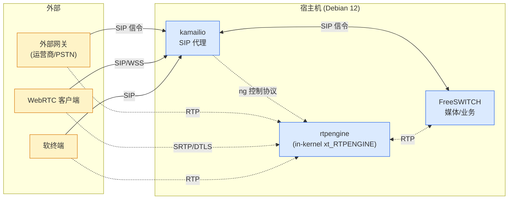
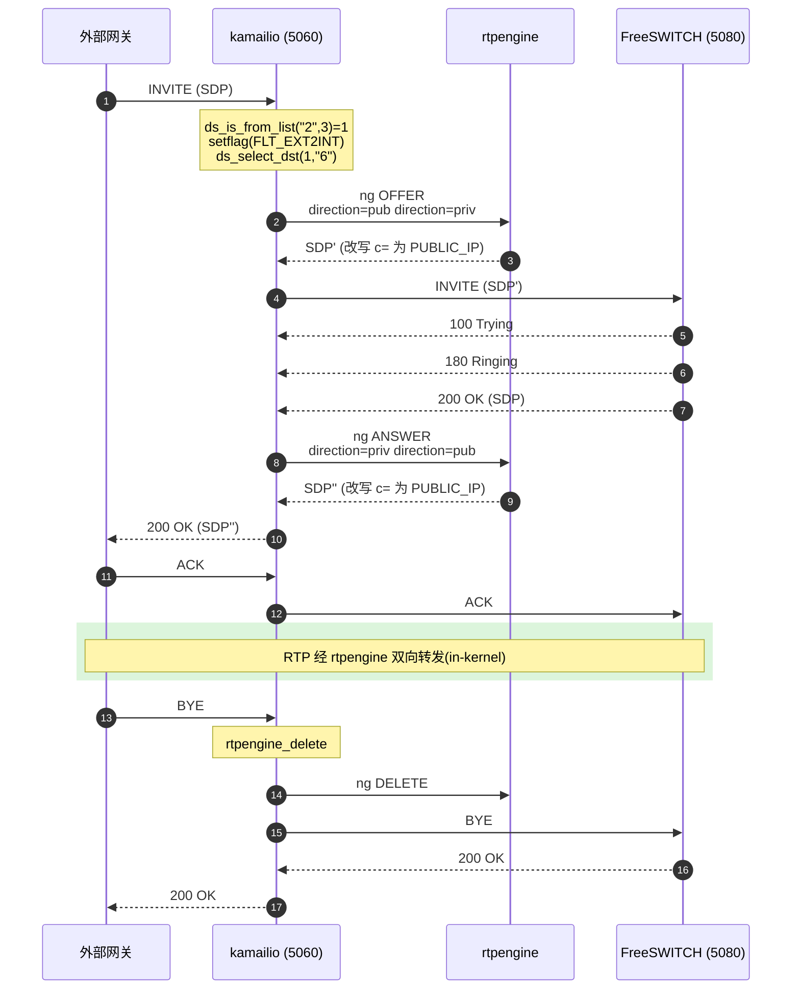
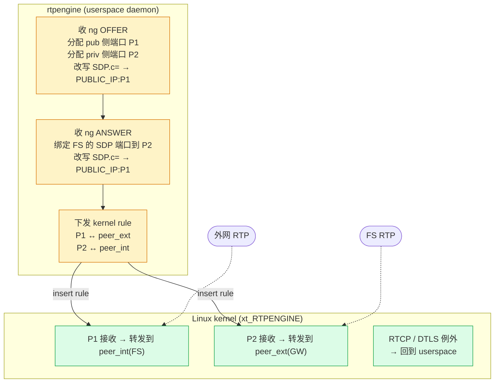

# 读懂 200 行 Lua:一个生产级 SBC 是怎么把 SIP 和 RTP 串起来的

> **TL;DR**
> SBC(Session Border Controller)看似复杂,核心其实就两件事:**kamailio 用 200 行 Lua 决定信令走哪、rtpengine 用一个内核模块把 RTP 转发掉**。本文用一份真实生产配置,带你看完一通呼叫从 INVITE 进门到 BYE 离场的全部 17 个动作,顺带讲清楚 WebRTC 和传统 SIP 怎么在 SBC 里互通。
>
> 读完应该能回答三个问题:
>
> 1. kamailio 怎么判断"这通呼叫从哪来,要往哪去"?
> 2. rtpengine 在 SDP 上动了哪些手脚?为什么它能改写媒体地址?
> 3. WebRTC 客户端进来,为什么不会"听不到声音"?
>
> **适合谁读**:做过 VoIP / 呼叫中心 / 实时音视频后端的工程师,或者正在被 kamailio.lua 折磨的运维。不需要你提前熟悉 SIP 协议细节,但需要知道 SIP 是个文本协议、RTP 是 UDP 媒体流就够了。

<!-- 封面图建议:画一张三方组件图,左边外部网关/WebRTC 客户端,中间 SBC(kamailio + rtpengine),右边 FreeSWITCH,标注 SIP 和 RTP 两条线 -->


---

## 1. 角色定位:三个组件各干什么



> 实线 = SIP 信令路径,虚线 = RTP 媒体路径。注意信令必经 kamailio,媒体必经 rtpengine —— **两条平面完全分离**。

- **kamailio**:SIP 代理。只看信令,不碰一字节媒体。负责鉴权、路由、Record-Route、把 SDP 交给 rtpengine。
- **rtpengine**:媒体代理。改写 SDP 里的 IP/端口,把上下行媒体流"对接"在自己开的中转端口上。本仓库用 `table = 0`(in-kernel 模式),报文在 netfilter 层就转发完了,不进用户态。
- **FreeSWITCH**:媒体服务器/业务逻辑。本文只把它当 kamailio 的内网下一跳。

三者之间没有"统一控制平面",彼此靠 SIP / ng / kernel module 三种协议解耦。这种解耦让 SBC 升级、扩容、单点故障都好处理 —— 媒体平面挂了不影响信令注册,反过来也成立。

---

## 2. dispatcher 列表:身份识别的源头

`install/conf/kamailio/dispatcher.list.example`:

```text
1 sip:10.2.0.8:5080      # set=1: FreeSWITCH(内网)
2 sip:182.92.68.27:5060  # set=2: 外部网关
```

整个路由逻辑的"分流器"就是这张表。kamailio.lua 里到处是这样的判断:

```lua
if KSR.dispatcher.ds_is_from_list("1", 3) > 0 then
    -- 来源 IP 命中 set 1 ⇒ 来自 FreeSWITCH
elseif KSR.dispatcher.ds_is_from_list("2", 3) > 0 then
    -- 来源 IP 命中 set 2 ⇒ 来自外部网关(呼入)
else
    -- 其余 ⇒ 可能是软终端 / WebRTC 客户端
end
```

第二个参数 `3` 表示同时比对 `address + port + proto`。**dispatcher.list 写错一行,整通呼叫的方向都会错**。

### 四个方向 flag

`kamailio.lua.tpl:1-13`:

```lua
FLT_INT2EXT = 20  -- FreeSWITCH → 外部
FLT_EXT2INT = 21  -- 外部 → FreeSWITCH
FLT_INT2INT = 22  -- 内部互打(本仓库实际未走)
FLT_EXT2EXT = 23  -- 外网穿透(本仓库实际未走)

MEDIA_EXTERNAL_TO_INTERNAL = " direction=pub direction=priv"
MEDIA_INTERNAL_TO_EXTERNAL = " direction=priv direction=pub"
```

这两组常量是信令侧 flag 和媒体侧 ng 参数的对应关系。**信令方向决定了媒体方向**,后面 `ksr_rtp_offer / ksr_rtp_answer` 会原样把 `direction=priv direction=pub` 串进 ng 报文交给 rtpengine。

### rtpengine 双 interface

`install/conf/rtpengine/rtpengine.conf.tpl`:

```ini
interface = priv/__PRIVATE_IP__;pub/__PRIVATE_IP__!__PUBLIC_IP__
```

- `priv` 接口:监听 `__PRIVATE_IP__`,SDP 里写出去的也是 `__PRIVATE_IP__`。给内网用。
- `pub` 接口:监听同一张 `__PRIVATE_IP__` 网卡(因为云主机外网 IP 一般是 NAT 映射,本机看不到 pub IP),但 SDP 里把 `c=` 行**广告**成 `__PUBLIC_IP__`。给外网用。

`pub/A!B` 的语义是:**bind 在 A,advertise 成 B**。这条配置是云上 SBC 的灵魂 —— 写错了外面听不到你,你也听不到外面。

---

## 3. 信令时序:一个外部呼入的完整流程

以"外部网关呼入软终端"为例(`kamailio.lua.tpl:63-80`):



### 关键步骤拆解

**① 入口护栏**(`ksr_route_reqinit`)

- OPTIONS 直接 `200 Keepalive`,不进路由
- `set_reply_no_connect` + `force_rport`:回包走来源连接,对称信令
- `process_maxfwd(10)`:Max-Forwards 兜底,防止环路

**② NAT 检测**(`ksr_route_natdetect`)

- `nat_uac_test(19)`:综合判断 Contact / Via / 源 IP 是否对得上
- 命中则 `set_contact_alias()`,把真实来源塞进 Contact 的 `;alias=` 参数。**后续回包靠这个 alias 找回路**

**③ 分流和 dispatcher**(主路由 `if KSR.is_INVITE()`)

来自 set 2(外部网关) ⇒ `setflag(FLT_EXT2INT)` ⇒ `ds_select_dst(1, "6")` 在 set 1(FreeSWITCH)里挑一台。`"6"` 是 dispatcher 的算法 flag —— round-robin。

**④ ksr_rtp_offer:让 rtpengine 改 SDP**

```lua
-- FLT_EXT2INT
direction = MEDIA_EXTERNAL_TO_INTERNAL  -- " direction=pub direction=priv"
reflags   = "trust-address replace-origin replace-session-connection"
KSR.rtpengine.rtpengine_offer(reflags .. direction)
```

rtpengine 收到 ng 报文,在 pub 接口分配一个端口,把 INVITE 的 SDP `c=`/`m=` 行改写成 **本机 pub 接口的 advertise 地址(`__PUBLIC_IP__`)**。这样外部网关认为"对端就在 SBC 公网 IP",发 RTP 直接打到 SBC。

**⑤ Record-Route 双面写**(`ksr_branch_manage`)

```lua
if KSR.isflagset(FLT_EXT2INT) then
    KSR.rr.record_route()
else
    KSR.rr.record_route_advertised_address("__PRIVATE_IP__:__SIP_UDP_PORT__")
end
```

- 外部 → 内部:用默认的 listen 地址(对外宣告的是 `__PUBLIC_IP__`,对内的 Route 由 kamailio 自己处理)
- 内部 → 外部:**强制写成 `__PRIVATE_IP__`** —— FreeSWITCH 在内网,后续 in-dialog 请求(ACK/BYE)应该顺着内网回到 kamailio,而不是绕公网

这一步保证 in-dialog 流量始终穿过本 SBC,媒体才不会"半路丢失"。

**⑥ 200 OK 回程:ksr_rtp_answer**

`ksr_onreply_manage` 在 reply 上挂钩子。FreeSWITCH 返回 200 OK 时:

```lua
-- 应答方向反过来:FLT_EXT2INT ⇒ direction=priv direction=pub
direction = MEDIA_INTERNAL_TO_EXTERNAL
KSR.rtpengine.rtpengine_answer(reflags .. direction)
```

rtpengine 这次把 FreeSWITCH 的 SDP(内网地址)改写成 **pub 接口的对外地址**,告诉外部网关:"你的对端在公网 IP X,端口 Y"。至此双向桥接完成。

**⑦ BYE:清理媒体上下文**

`ksr_route_relay` 里:

```lua
if KSR.is_BYE() then
    KSR.rtpengine.rtpengine_delete("")
    KSR.nathelper.handle_ruri_alias()
end
```

`rtpengine_delete` 是把会话对应的两个端口归还、in-kernel 转发规则从 netfilter 删掉。**不调这个,端口会泄漏**,几万通呼叫之后 port-min/port-max 会耗尽。

---

## 4. 媒体路径:rtpengine 在做什么

信令搞定后,媒体走的是另一条路。**rtpengine 不和 kamailio 共享代码空间**,它们之间靠 `udp:127.0.0.1:__RTPE_NG_PORT__` 上的 ng 协议(基于 bencode 的 RPC)通信。

### 一通呼叫期间 rtpengine 的视角



### in-kernel 模式有什么用

`rtpengine.conf.tpl:2`:

```ini
table = 0
```

`table = 0` 表示加载 `xt_RTPENGINE` 内核模块,把媒体转发规则下到 netfilter。报文在 `PREROUTING` 阶段就被转发出去,**不需要 read()/write() 到用户态**。

实测意义:

- 单台机器轻松扛万级并发 RTP 流
- 抖动几乎只受网卡和内核调度影响
- 但 DTLS 协商、RTCP 解析、SDES 加解密这些**仍在用户态**,kernel 只接管"建立稳定流之后的纯转发"

**注意**:Docker 版的参考实现用 `table = -1` 是 userspace 模式,本仓库不要照抄。`CLAUDE.md` 里专门提醒过这点。

### 端口范围

```ini
port-min = __RTPE_PORT_MIN__
port-max = __RTPE_PORT_MAX__
```

每通呼叫占用 2 个端口(RTP + RTCP,或 RTCP-mux 时只占 1 个)。port 范围决定了**理论并发上限**。生产规划时要留足余量,以及在防火墙打开对应 UDP 段。

---

## 5. WebRTC:为什么单独一套 flag

`kamailio.lua.tpl:8-9, 92-94, 341-347`:

```lua
WEBRTC_UAC = 25
WEBRTC_UAS = 26

-- 客户端走 ws/wss 时
if KSR.pv.gete('$proto') == "ws" or KSR.pv.gete('$proto') == "wss" then
    KSR.setflag(WEBRTC_UAC);
end
```

WebRTC 和传统 SIP 在媒体协商上**不兼容**:

| 维度        | 传统 SIP/UDP                 | WebRTC                          |
|-----------|-----------------------------|---------------------------------|
| 传输       | RTP/AVP(明文)                 | RTP/SAVPF(SRTP + 反馈)            |
| 加密       | 无 / SDES                     | DTLS-SRTP                       |
| NAT 穿透   | rport / Contact alias        | ICE(candidate + STUN)             |
| RTCP     | 独立端口(P+1)                  | RTCP-MUX(和 RTP 同端口)           |
| 复合流标识 |                              | a=mid                            |

如果两端有一端是 WebRTC,rtpengine 必须做**协议转换**。`ksr_rtp_offer` 里给 WebRTC UAC 的标志位:

```lua
reflags = "trust-address replace-origin replace-session-connection "
       .. "rtcp-mux-demux DTLS=off SDES-off ICE=remove RTP/AVP"
```

逐字解读这串 ng flag:

- `rtcp-mux-demux`:**对端发来的是 mux 的,SBC 出去要拆成两个端口**(给传统 SIP 侧用)
- `DTLS=off SDES=off`:解掉 SRTP 加密 —— 拆完密之后传统侧拿到明文 RTP
- `ICE=remove`:把 SDP 里的 `a=candidate` 全删了,传统 SIP 侧不认
- `RTP/AVP`:把 `m=audio ... RTP/SAVPF` 替换成 `RTP/AVP`

`ksr_rtp_answer` 的方向反过来:从传统侧拿到的明文 SDP,要**包装成 WebRTC 能吃的**:

```lua
reflags = "trust-address replace-origin replace-session-connection "
       .. "rtcp-mux-offer generate-mid DTLS=passive SDES-off ICE=force RTP/SAVPF"
```

- `rtcp-mux-offer`:输出 SDP 加上 `a=rtcp-mux`
- `generate-mid`:补 `a=mid`
- `DTLS=passive`:由 SBC 当被动方,等 WebRTC 客户端发起 DTLS 握手
- `ICE=force`:输出 SDP 必须带 ICE candidate
- `RTP/SAVPF`:m 行改成 SAVPF

**为什么 UAS 和 UAC 的 flag 不一样**:

```lua
if KSR.isflagset(WEBRTC_UAC) then
    -- offer 阶段:把 WebRTC 的 SDP 转成传统 SIP
elseif KSR.isflagset(WEBRTC_UAS) then
    -- offer 阶段:把传统 SDP 转成 WebRTC
```

谁是 UAC(主叫)谁是 UAS(被叫)决定 OFFER 阶段 SDP 是从哪边来的。SDP 协商是 offer/answer 模型,**OFFER 阶段做了协议转换,ANSWER 阶段反向**才能两边都对得上。

### 注册路径上的客户端标记

`ksr_route_registrar:252-256`:

```lua
local client = "webrtc"
if KSR.is_UDP() then
    client = "soft_switch"
end
KSR.htable.sht_setxs("sips", KSR.pv.gete("$fU"), client, 3600);
```

注册时把"这个 sip 用户是 webrtc 还是普通软终端"存到 htable,1 小时过期。后面 FreeSWITCH 反向呼叫这个用户时(`kamailio.lua.tpl:46, 112`),通过 htable 查回去判断要不要 `setflag(WEBRTC_UAS)`。这是**注册侧和呼叫侧的解耦**:呼叫时不用再 parse Contact 里的 transport。

---

## 6. 一些容易踩的坑

### 6.1 in-dialog ACK/BYE/INFO 必须转发,不能代答

`kamailio.lua.tpl:145-149`:

```lua
-- in-dialog 转发:ACK/BYE/INFO 都是端到端消息,由目标 UA(freeswitch 或网关)
-- 处理。kamailio 不要代答,按 Request-URI 转发(loose_route 已把 RURI 指向下一跳)。
if KSR.is_ACK() or KSR.is_BYE() or KSR.is_INFO() then
    ksr_route_relay()
end
```

INFO 早期版本里被错误地"代答 200",会导致 DTMF 信令丢失。现在的版本统一交给 `loose_route` 之后转发,kamailio 只是邮差。

### 6.2 Record-Route advertised address

外部 → 内部方向,Route 头默认填的是 listen 地址。如果 `listen=udp:0.0.0.0:5060 advertise __PUBLIC_IP__:5060`,RR 里就是 `__PUBLIC_IP__`。但内部 → 外部时,我们**不希望**内网 FreeSWITCH 后续 BYE 绕一圈走公网,所以强制改成 `__PRIVATE_IP__`。

### 6.3 dispatcher.list 不要 commit 假 IP

`CLAUDE.md` 里硬规则:`dispatcher.list.example` 是模板,首次安装时**只在文件不存在**时落一份警告占位,运维必须手填。例子里的 `10.2.0.8 / 182.92.68.27` 是占位,不是默认值。

### 6.4 rtpengine_delete 不能漏

failure_route 和 BYE 路径都要清理:

```lua
function ksr_failure_manage()
    KSR.rtpengine.rtpengine_delete("")
end
```

INVITE 超时、4xx/5xx 错误、BYE 正常挂机 —— 三条路径都要释放媒体上下文,否则端口和 kernel 转发规则会泄漏。

### 6.5 trust-address 是个安全开关

所有 `ksr_rtp_offer/answer` 都带 `trust-address` —— 意思是"信任 SDP 里写的 c= 地址,不去问 SIP 包的真实源 IP"。在 NAT 复杂的环境下可能要去掉,改成默认的"以 SIP 源 IP 为准"。本仓库假设对端是受信任的网关或者已经经过 NAT 修复(`set_contact_alias`),所以可以信。

---

## 7. 整体回顾:一通呼叫的 17 步

| #  | 信令路径(kamailio)                       | 媒体路径(rtpengine)              |
|----|------------------------------------------|----------------------------------|
| 1  | INVITE 进入 5060/UDP                     |                                  |
| 2  | reqinit:OPTIONS / maxfwd / rport         |                                  |
| 3  | natdetect:Contact 加 alias                |                                  |
| 4  | dispatcher 识别来源 set                  |                                  |
| 5  | setflag FLT_EXT2INT / FLT_INT2EXT        |                                  |
| 6  | (WebRTC?) setflag WEBRTC_UAC/UAS         |                                  |
| 7  | ds_select_dst 选下一跳                   |                                  |
| 8  | ksr_rtp_offer → ng OFFER                 | 9. 分配双侧端口 P1/P2            |
|    |                                          | 10. 改写 SDP c= 为 PUBLIC_IP     |
| 11 | t_relay:发 INVITE'                       |                                  |
| 12 | 200 OK 进入 onreply_route                |                                  |
| 13 | ksr_rtp_answer → ng ANSWER               | 14. 反向改写 SDP                 |
|    |                                          | 15. 下发 kernel 转发规则         |
| 16 | ACK 透传(loose_route)                    | ═══ RTP 流转(双向) ═══           |
| 17 | BYE → rtpengine_delete                   | 释放端口/规则                    |

把这张表挂在屏幕上看一遍 lua 文件,基本就通了。

---

## 8. 调试 Cheat Sheet

| 现象                               | 优先看哪                                                 |
|-----------------------------------|---------------------------------------------------------|
| 呼叫接通但单通/无声音               | `rtpengine-ctl list sessions`,查端口对接是否完成      |
| WebRTC 连不上                       | rtpengine 日志找 DTLS / ICE,检查 reflags 拼接是否正确  |
| 呼叫方向判断错                      | `dispatcher.list` set 序号,`ds_is_from_list` 第二参 3 |
| in-dialog BYE 失败                  | Record-Route advertised address,可能写到了私网 IP     |
| 几小时后媒体端口耗尽                | grep `rtpengine_delete` 调用路径,有无遗漏分支          |
| 注册用户能注册但被叫接不到          | htable `sips` 里的 client 值,以及 ds_select 是否走对  |
| kamailio 加载了 cfg 但行为像默认 cfg | `/etc/default/kamailio` 是否完整(`CFGFILE` 必须有)    |

---

## 9. 进一步阅读

- 源码:`install/conf/kamailio/kamailio.lua.tpl`(本文一切引述的出处)
- rtpengine ng flag 完整列表:`man rtpengine`(daemon 文档),或 `https://github.com/sipwise/rtpengine` README
- KEMI(Kamailio Embedded API)函数索引:Kamailio Wiki "KEMI"
- in-kernel 模式原理:`xt_RTPENGINE` 内核模块的 `README` 在 sipwise/rtpengine 仓库的 `kernel-module/` 目录

---

> 本仓库是宿主机原生部署版本,目标 OS 锁定 Debian 12 bookworm。一键安装走 `install/install.sh`,真机验收看 `docs/superpowers/checklists/sbc-install-smoke.md`。

---

**写在最后**

这篇文章里的所有配置片段都来自一个正在跑生产流量的 SBC,不是 demo 也不是网上抄的"最小例子"。如果你正在搭呼叫中心、做云通信、或者只是好奇电话是怎么"流"到耳朵里的,希望这 200 行 Lua 的拆解能帮你省下我当年踩过的坑。

文章如有错漏,欢迎在评论区指出。转载请保留出处。
